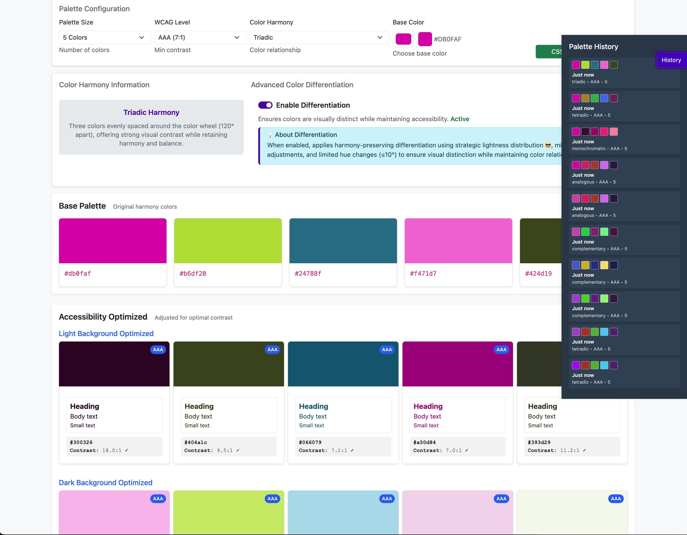

# Accessible Color Palette Generator

A web-based tool that generates accessible color palettes meeting WCAG standards with optimized versions for both light and dark backgrounds. Optional color differentiation makes the individual shades more distinguishable but tries to preserve the tint/hue of the original palette.



## ✨ Features

### 🎨 Color Generation
- **5 Color Harmony Types**: Complementary, Triadic, Analogous, Monochromatic, Tetradic
- **WCAG Compliance**: AA (4.5:1) and AAA (7:1) contrast ratio support
- **Background optimization**: Separate palettes for light and dark backgrounds
- **Different palette sizes**: 3 or 5 colors per palette

### 🔍 Advanced Color Differentiation
- **Harmony preservation**: Maintains original color theory relationships
- **Strategic lightness distribution**: Primary differentiation method
- **Minimal hue adjustments**: ≤10° changes to preserve harmony
- **Predictable results**: Same inputs produce consistent outputs

### 💾 Export & History
- **Multiple export formats**: CSS custom properties and JSON
- **Palette history**: Track and reload previous generations
- **Usage examples**: CSS implementation patterns included

## 🚀 Quick Start

### Online Version
Visit the live demo: [https://web.key4.lu/accessible-color-palette-generator/]

## 📁 Project Structure

```
wcag-color-palette-generator/
├── index.php                 # Main HTML interface
├── styles.css               # Complete styling with responsive design
├── app.js                   # Main application coordinator
├── core/
│   ├── ColorUtil.js         # Color manipulation and calculations
│   ├── ColorHarmonies.js    # Color theory algorithms
│   └── StateManager.js      # Application state management
├── generators/
│   └── PaletteGenerator.js  # Palette generation and differentiation
├── ui/
│   └── UIComponents.js      # UI rendering components
├── utils/
│   ├── ExportManager.js     # CSS/JSON export functionality
│   ├── HistoryManager.js    # Palette history management
│   └── AccessibilityUtils.js # Keyboard navigation & accessibility
├── types/
│   └── index.d.ts           # TypeScript definitions
└── documentation.md         # Technical documentation
```

## 🎯 Usage

### Basic Usage

1. **Choose your base color** using the color picker
2. **Select harmony type** (Complementary, Triadic, etc.)
3. **Set WCAG level** (AA or AAA)
4. **Choose palette size** (3 or 5 colors)
5. **Toggle color differentiation** for enhanced visual distinction
6. **Export** your palette as CSS or JSON

### Color Differentiation

The advanced differentiation feature ensures colors are visually distinct while maintaining harmony:

- **Enable/Disable**: Simple toggle control
- **Harmony-preserving**: Uses strategic lightness distribution
- **WCAG-compliant**: All adjustments improve contrast ratios
- **No history pollution**: Toggle changes don't create history entries

### Keyboard Shortcuts

| Key | Action |
|-----|--------|
| `H` | Toggle history panel |
| `G` | Re-generate the palette (Not very useful) |
| `E` | Export as CSS |
| `Shift+E` | Export as JSON |
| `C` | Copy first color |
| `?` | Show keyboard shortcuts |
| `Escape` | Close panels or remove focus |

## 🎨 Color Theory

The generator implements standard color harmony algorithms:

- **Complementary**: Colors opposite on the color wheel (180°)
- **Triadic**: Three colors evenly spaced (120° apart)
- **Analogous**: Adjacent colors (25-50° apart)
- **Monochromatic**: Single hue with varied saturation/lightness
- **Tetradic**: Four colors forming a rectangle (90° apart)

## 📊 Export Formats

### CSS Export
```css
:root {
  /* Base Palette (Original Harmony) */
  --color-1: #5500AA;
  --color-2: #AA5500;
  
  /* Light Background Optimized */
  --color-1-light: #440088;
  --color-2-light: #884400;
  
  /* Dark Background Optimized */
  --color-1-dark: #7722CC;
  --color-2-dark: #CC7722;
}
```

### JSON Export
```json
{
  "metadata": {
    "generated": "2024-01-20T15:30:00.000Z",
    "generator": "WCAG Color Palette Generator v0.6",
    "wcagLevel": "AA",
    "harmonyType": "triadic"
  },
  "palettes": {
    "base": [...],
    "lightOptimized": [...],
    "darkOptimized": [...]
  },
  "accessibility": {
    "contrastRatios": {...},
    "wcagCompliance": {...}
  }
}
```

**Made with ❤️ in Luxembourg 🇱🇺**